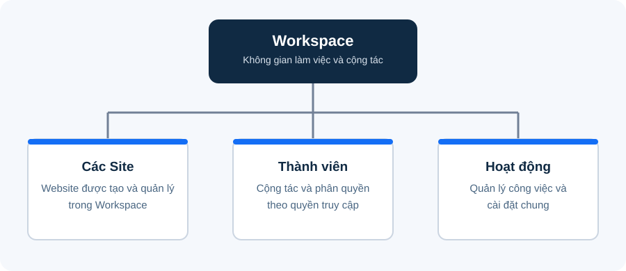
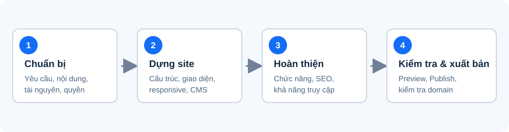

# Tài liệu Webflow

Tài liệu tổng hợp các khái niệm và quy trình cơ bản để triển khai, quản lý và xuất bản website bằng Webflow. Nội dung dành cho người tham gia xây dựng hoặc cập nhật website; không phải giáo trình theo buổi học.

## 1. Webflow là gì?

Webflow là nền tảng thiết kế và quản lý website trực quan. Người dùng có thể tạo giao diện, quản lý nội dung CMS và xuất bản website mà không cần tự viết toàn bộ HTML, CSS. Webflow vẫn sử dụng các khái niệm web tiêu chuẩn như element, class, responsive, URL và hosting.

Tính năng CMS, xuất bản và tên miền có thể phụ thuộc vào gói tài khoản. Giao diện sản phẩm cũng có thể thay đổi theo thời gian.

## 2. Thành phần chính

- **Workspace:** Không gian làm việc để quản lý các site, thành viên và hoạt động cộng tác trong Webflow. Một tài khoản có thể tham gia nhiều Workspace; quyền truy cập và tính năng có thể khác nhau tùy Workspace.
- **Site / Project:** Website được tạo và quản lý trong Webflow.
- **Designer:** Khu vực dựng trang và tùy chỉnh giao diện.
- **Element:** Thành phần nội dung như Section, Container, Heading, Text, Image, Link và Form.
- **Navigator:** Cây phân cấp các element trên trang, dùng để xem và sắp xếp cấu trúc.
- **Class:** Tập hợp style có thể dùng lại cho một hoặc nhiều element.
- **Breakpoint:** Kích thước màn hình dùng để điều chỉnh cách hiển thị responsive.
- **Component:** Thành phần giao diện có thể tái sử dụng, thường dùng cho header, footer hoặc các khối lặp lại.
- **CMS Collection:** Tập hợp dữ liệu có cấu trúc, ví dụ bài viết, dự án hoặc nhân sự.
- **Collection Template:** Mẫu trang chi tiết được dùng cho từng bản ghi trong Collection.
- **Publish:** Đưa thay đổi lên domain staging của Webflow hoặc custom domain đã cấu hình.

### Workspace và Site

*Sơ đồ khái quát: một Workspace có thể quản lý nhiều site cùng thành viên và hoạt động cộng tác.*

## 3. Quy trình triển khai website cơ bản

*Quy trình tổng quát; các bước chi tiết được trình bày bên dưới.*

### Bước 1: Xác định yêu cầu và chuẩn bị nội dung

- Xác định mục tiêu website, nhóm người dùng và hành động chính cần hướng đến.
- Liệt kê các trang cần có, ví dụ Trang chủ, Giới thiệu, Dịch vụ, Bài viết và Liên hệ.
- Chuẩn bị logo, nội dung, hình ảnh, thông tin liên hệ và tài liệu thương hiệu.
- Xác định nội dung nào cập nhật thường xuyên để quyết định có cần dùng CMS không.
- Xác nhận người phụ trách nội dung, tên miền và quyền xuất bản.

### Bước 2: Tạo site và thiết lập cấu trúc

- Tạo site mới từ trang trống hoặc template phù hợp.
- Tạo các trang cần thiết và thống nhất cách đặt tên.
- Dựng cấu trúc cơ bản bằng các vùng Section, Container và element phù hợp.
- Dùng Navigator để giữ cây element rõ ràng, dễ bảo trì.
- Tạo Component cho các phần giao diện lặp lại như header và footer.

### Bước 3: Dựng giao diện

- Xây dựng bố cục bằng Flexbox hoặc Grid; giới hạn chiều rộng nội dung bằng Container.
- Dùng `gap`, `padding` và `margin` có chủ đích để kiểm soát khoảng cách.
- Tạo class có tên rõ nghĩa và tái sử dụng style cho các thành phần tương tự.
- Giữ nhất quán về màu sắc, font, cỡ chữ, nút bấm và khoảng cách.
- Dùng đúng element theo mục đích: Heading cho tiêu đề, Link để điều hướng và Button cho hành động.

### Bước 4: Thiết lập responsive

- Kiểm tra các trang ở desktop, tablet và mobile.
- Điều chỉnh bố cục, cỡ chữ, khoảng cách, hình ảnh và menu tại từng breakpoint.
- Tránh chiều rộng cố định không cần thiết; kiểm tra nội dung dài và hình ảnh lớn.
- Thử các kích thước màn hình trung gian, không chỉ các kích thước mặc định.
- Sau khi sửa breakpoint nhỏ, xem lại các breakpoint khác để bảo đảm không phát sinh lỗi.

### Bước 5: Thiết lập CMS khi cần

1. Tạo Collection theo loại nội dung cần quản lý.
2. Khai báo các field phù hợp, ví dụ tên, slug, mô tả, hình ảnh, ngày đăng và nội dung.
3. Tạo bản ghi mẫu và kiểm tra dữ liệu.
4. Dùng Collection List để hiển thị danh sách và kết nối element với field tương ứng.
5. Thiết kế Collection Template cho trang chi tiết.
6. Kiểm tra trường hợp thiếu dữ liệu, nội dung dài, filter và sort.

Không cần dùng CMS cho nội dung tĩnh, ít thay đổi nếu việc quản lý dữ liệu động không đem lại lợi ích.

### Bước 6: Hoàn thiện chức năng

- Thiết lập liên kết nội bộ, menu, nút CTA và biểu mẫu.
- Cấu hình tương tác cần thiết như menu mở/đóng hoặc hiệu ứng hover; tránh hiệu ứng dư thừa.
- Gửi thử biểu mẫu và xác nhận dữ liệu được chuyển đến đúng nơi.
- Kiểm tra các trạng thái hover, focus, lỗi và thành công của thành phần tương tác.

### Bước 7: SEO và khả năng truy cập cơ bản(Nếu có yêu cầu)

- Đặt page title và meta description riêng cho từng trang.
- Dùng cấu trúc Heading hợp lý, thông thường một Heading 1 chính cho nội dung trang.
- Tạo slug ngắn, dễ đọc và phù hợp với nội dung.
- Thêm alt text cho hình ảnh mang thông tin; dùng alt rỗng cho hình trang trí khi phù hợp.
- Đặt Open Graph title, description và hình ảnh chia sẻ.
- Đảm bảo độ tương phản màu dễ đọc, biểu mẫu có nhãn và nội dung có thể thao tác bằng bàn phím.

### Bước 8: Kiểm tra và xuất bản

Trước khi Publish:

- Rà soát nội dung, lỗi chính tả, hình ảnh và liên kết trên tất cả các trang.
- Kiểm tra giao diện ở desktop, tablet và mobile.
- Thử menu, nút, CTA, biểu mẫu, nội dung CMS và các tương tác.
- Kiểm tra title, meta description, favicon và ảnh chia sẻ.
- Tối ưu kích thước ảnh, hạn chế font, animation và embed không cần thiết.
- Xác nhận domain, quyền xuất bản và môi trường đích.

Thực hiện Preview trước, sau đó Publish lên domain staging hoặc custom domain đã được cấu hình và cho phép. Mở website đã xuất bản để kiểm tra lại. Nếu custom domain chưa hoạt động, kiểm tra cấu hình DNS theo hướng dẫn hiện hành của Webflow và thời gian cập nhật DNS.

## 4. Nguyên tắc quản lý và bảo trì

- Dùng quy ước đặt tên class và component nhất quán.
- Hạn chế tạo nhiều class trùng lặp hoặc lồng element không cần thiết.
- Kiểm tra ảnh hưởng của class dùng chung trước khi thay đổi style.
- Cập nhật nội dung CMS đúng field và kiểm tra trước khi publish.
- Sau mỗi thay đổi lớn, Preview và kiểm tra lại các trang, breakpoint liên quan.
- Chỉ cấp quyền và xuất bản lên domain theo quy trình của chủ dự án.

## 5. Xử lý sự cố thường gặp

| Hiện tượng                             | Việc cần kiểm tra                                                      |
| ----------------------------------------- | ------------------------------------------------------------------------- |
| Style thay đổi trên nhiều element     | Kiểm tra class dùng chung, selector và style kế thừa                 |
| Nội dung tràn trên mobile              | Kiểm tra width/min-width, padding, ảnh và bố cục Flexbox/Grid        |
| Danh sách CMS trống                     | Kiểm tra Collection, trạng thái publish, filter và dữ liệu bản ghi |
| Trang CMS thiếu nội dung                | Kiểm tra kết nối field và dữ liệu của bản ghi                     |
| Link, nút hoặc form không hoạt động | Kiểm tra URL, action, cấu hình form và trạng thái thành phần      |
| Thay đổi chưa hiển thị trên website | Publish lại đúng site/domain và kiểm tra cache trình duyệt         |
| Custom domain chưa truy cập được     | Kiểm tra cấu hình DNS, SSL và thời gian cập nhật DNS               |

## 6. Tài liệu tham khảo

- [Webflow University](https://university.webflow.com/)
- [Webflow Help Center](https://help.webflow.com/)
